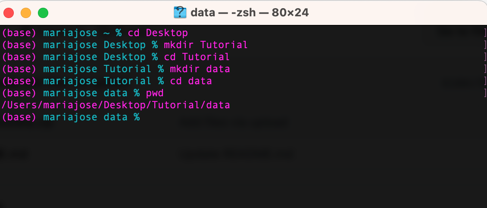
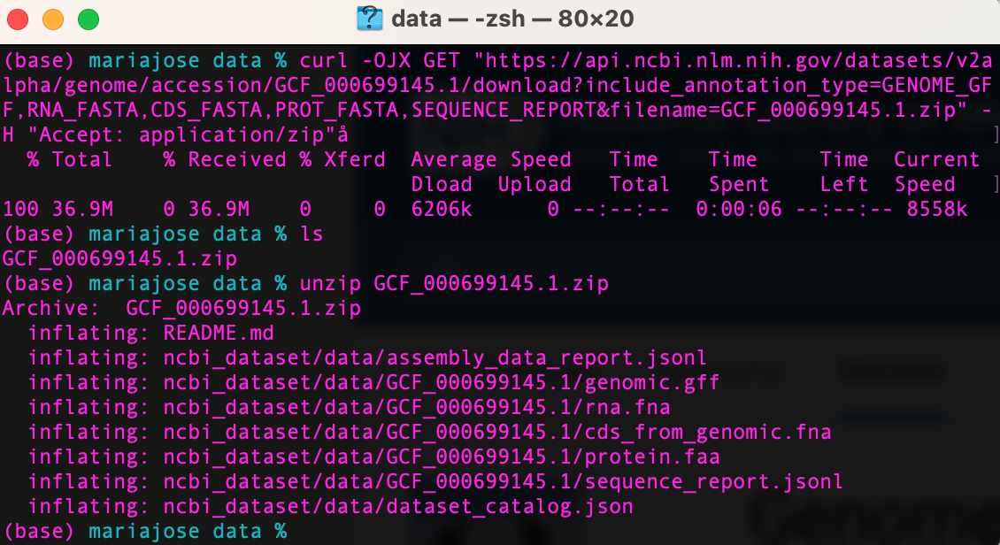
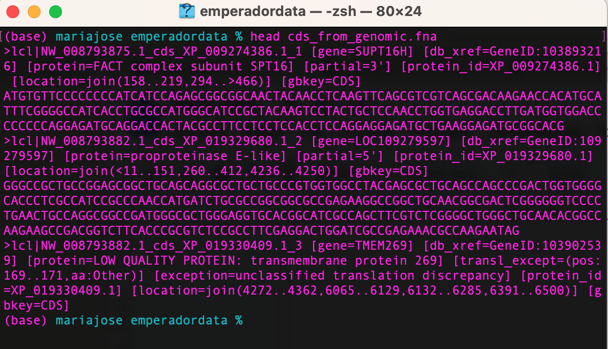
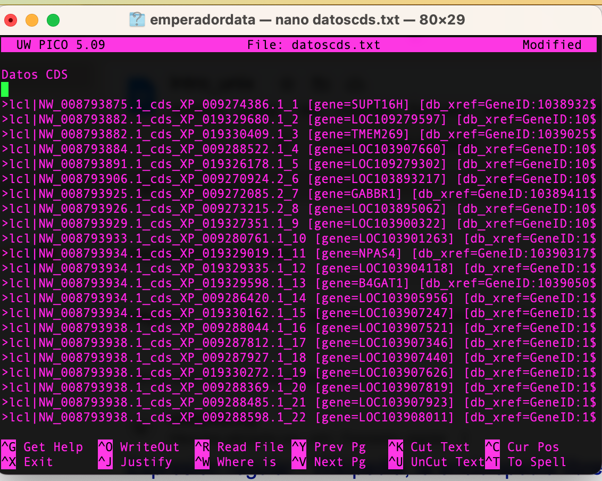

# Familiarización con la terminal Bash: Día 1

**¿Qué es la terminal Bash o Shell?**

La "Shell" es una interfaz de usuario que opera a través de líneas de comando. Estos comandos son, de por sí, programas que actúan como interlocutores o intérpretes entre sistemas complejos y nosotros. Entre sus principales atributos destacan su capacidad de multitarea y multiusuario. La característica multitarea, como su nombre lo indica, permite realizar más de una función o tarea simultáneamente en varias ventanas o pestañas. Por otra parte, el rasgo multiusuario permite realizar distintas tareas a más de una persona en la misma terminal simultánemente.

Como mencionamos con anterioridad, nos podemos comunicar con el sistema operativo a través de un interlocutor; los comandos. Ahora, comenzaremos a aprender un lenguaje que nos permitirá interactuar y dar instrucciones al sistema para la ejecución de una tarea. Usualmente, los comandos son acrónimos de palabras en inglés y se definen según la función que desempeñan.

Primero hagamos un saludo al sistema operativo, haciendo que se imprima en la pantalla a través del comando ``echo`` (es un eco de lo que quieres imprimir en pantalla).

```
echo Hello World
```


## Navegar entre sistemas de archivos

Muchas veces nos resultará útil saber en qué carpeta estamos (desde ahora llamaremos a las carpetas directorios). Para ello utilizamos el comando ``pwd`` (print working directory).

```
 pwd
```
```/home/usuario```

Generalmente cuando ingresamos por primera vez a la terminal, el sistema nos redirige al home del usuario. Será conveniente cambiarnos de directorio y para ello usaremos el comando ``cd`` (change directory).

```
cd Documentos
```

Ahora verifiquemos que nos cambiamos de directorio con pwd.

```
pwd
```
```/home/usuario/Documentos```

Dado que nos cambiamos a Documentos, ahora creémos un subdirectorio llamado Genobiostoic dentro de Documentos con el comando ``mkdir`` (make directory).

```
mkdir Genobiostoic
```

>**Nota**: En ocasiones, puede suceder que creamos un directorio en un lugar equivocado, o que simplemente queramos deshacernos de un directorio en desuso. El comando para eliminar un directorio dependerá de si este se encuentra o no vacío. Si un directorio **se encuentra vacío**, entonces utilizaremos el comando ``rmdir``, acrónimo de “remove directory”, para eliminarlo. Ahora bien, si el directorio que queremos eliminar **contiene archivos u otros directorios**, debemos utilizar el comando ``rm``, acrónimo de "remove", junto con otra instrucción, ``-r``, que indica al comando rm que la remoción debe ser *recursiva* para todo el contenido del directorio. Así, para remover directorios que no se encuentren vacíos, utilizaremos ``rm -r``. **¡Cuidado! La remoción de directorios mediante rm -r es riesgosa, pues no tiene vuelta atrás. Asegúrate de utilizar este comando con precaución, procurando que los archivos que eliminarás sean los correctos.** 


Verifiquemos que se haya creado el directorio Genobiostoic a través del comando ``ls`` (list).

```
ls
```

Aquí observamos que se ha creado un nuevo directorio llamado Genobiostoic, cuyo directorio parental es Documentos. Entremos al directorio con ``cd`` y verifiquemos el sistema anidado y jerárquico de directorios con ``pwd``.

```
pwd
```
```/home/usuario/Documentos/Genobiostoic```

En la terminal, las rutas relativas y absolutas se utilizan para especificar la ubicación de un archivo o directorio en el sistema de archivos. Una ruta absoluta, como su nombre lo indica, es una ruta completa que comienza desde la raíz o home del sistema de archivos y especifica la ubicación exacta de un archivo o directorio. En Linux toda ruta absoluta comienza con un slash (/). Por el contrario, una ruta relativa especifica la ubicación de un archivo o directorio en relación con la ubicación actual. No comienza con un slash (/) y depende la ruta donde se encuentre el usuario.


Ahora que tenemos creado un directorio llamado *Genobiostoic* construyamos esta jerarquía de archivos:


## Descargar archivos

Ahora que sabemos cómo crear directorios, movernos entre ellos y listar su contenido, aprendamos a descargar archivos desde repositorios remotos a través de líneas de comando. Para ello usaremos ```wget```. En esta oportunidad descargaremos el Libro de literatura inglesa clásica Dr. Jeckyll y Mr.Hyde en el directorio Genobiostoic a través de este comando:


```
wget https://www.gutenberg.org/cache/epub/43/pg43.txt
```
Verifiquemos que se haya descargado el libro con el comando ```ls```.


El comando ```mv``` (move) permite cambiar el nombre de un archivo o directorio. Cambiemos el nombre del libro desde pg43.txt a libro.txt.


```
mv pg43.txt libro.txt
```

En este punto hemos dado una instrucción, mover o cambiar el nombre de un archivo (pg43.txt) por otro nombre de archivo (libro.txt).
El comando ```mv``` también permite mudar archivos entre directorios. Si queremos mudar "libro.txt" desde Genobiostoic a Practica1 escribamos el siguiente comando:

```
mv libro.txt Terminal/Libro

```

Luego, verifiquemos que efectivamente hayamos mudado el archivo libro.txt al directorio indicado.

```
cd Terminal/Libro
ls
```
```libro.txt```


Si queremos imprimir **todo** el libro en pantalla ocupamos el comando ```cat```, este nos mostrará todo el libro sin la posibilidad de editarlo.

A continuación haremos una práctica más extensa con diversos comandos para interactuar con distintos tipos de archivos.


## Interactuar con archivos

Lo primero que haremos en esta sección será crear un archivo con un editor de texto. La terminal shell trae un editor de texto instalado llamado ``nano``. Basta con invocarlo tipeando nano en la terminal.

```
nano
```

A continuación se abre una ventana en la que podemos pegar, tipear y/o editar el texto que deseemos. Presionando ^x salimos del editor de texto nano y regresamos a la terminal. Ahora que sabemos invocar el editor de texto procedamos a crear un documento de texto plano **.txt** llamado *verde*. Para ello copiemos el poema de Federico García Lorca (Disponible al final de esta sección) y seguidamente invoquemos ```nano``` y creémos al mismo tiempo el documento con su nombre y extensión:

```
nano verde.txt
```

Ahora peguemos el poema de Federico Garcia Lorca dentro del documento en nano, guardemos con ^o y salgamos de nano con ^x. Verifiquemos que se ha creado el documento con el comando ``ls``, debería aparecer el nombre del documento "verde.txt" en el directorio.

```
ls
```

En este punto aprenderemos varios comandos que nos permitiran interactuar con estos archivos. Como vimos, el programa ```nano``` nos confiere el permiso de editar o modificar el documento. Ahora bien, muchas veces queremos ver el documento, es decir, imprimir el contenido en la pantalla sin que sea modificado. Para esto ocupamos el comando ``cat`` (concat):

```
cat verde.txt
```

A continuación el texto contenido en el documento se imprimirá en la pantalla. Muchas veces, cuando trabajamos con datos genómicos muy grandes es poco conveniente imprimir todo su contenido, de hecho la concatenación del documento puede durar varios minutos. Si nos pasa esto podemos detener la impresión en pantalla con ^C. Si deseamos limpiar la pantalla, basta con tipear clear en la terminal:

```
clear
```

Como mencionamos, en ocasiones queremos imprimir el encabezado o cierto número de líneas del documento, para ello utilizamos el comando ``head`` (head):

```
head verde.txt
```

Varios comandos tienen ciertas funciones, por ejemplo ``head`` acompañado de la función ``-n`` (number) permite indicar el número de lineas a imprimir en pantalla. Por lo tanto, el comando ``-n 40`` imprime en pantalla las primeras 40 lineas del documento:

```
head -n 40 verde.txt
```


También, podemos imprimir el final de un documento con el comando ``tail``.

```
tail verde.txt
```

Al igual que ``head``, ``tail`` acepta la función ``-n`` y podemos imprimir el *número* de lineas que deseemos, contando desde el final hacia el principio del documento.


Cuando se trabajan con datos Genómicos, muchas veces queremos buscar, ubicar o filtrar ciertos loci, cromosomas, individuos, etc dentro de un archivo, para ello ocupamos el comando ``grep`` (globally search for regular expression and print out). En este ejemplo buscaremos la palabra verde en el texto verde.txt, para ello tipearemos:

```
grep verde verde.txt
```

Aquí, vale la pena resaltar que dimos una instrucción distinta, ordenamos buscar (``grep``) una palabra (verde) en un archivo (verde.txt). De esta forma diseñamos la sintaxis de un programa un poco más complejo que los anteriores.

Ahora vayamos más allá y busquemos (``grep``) un palabra (*Compadre*) y contemos cuántas veces se repite con ``wc`` (word count) y la función ``-l`` que permite contar el número de líneas.

```
grep "Compadre" verde.txt | wc -l
```


En este apartado tendremos la oportunidad de descargar una tabla con ```wget``` y luego filtrar con el comando ```awk``` la primera y segunda columna de la tabla. Esta herramienta en muy útil cuando se trabaja con archivos .xlsx y .csv.

```
wget https://ftp.ncbi.nlm.nih.gov/genomes/all/GCA/010/085/365/GCA_010085365.1_BGI_Echrysoc_fil.V1/GCA_010085365.1_BGI_Echrysoc_fil.V1_assembly_stats.txt
```

Para filtrar la primera columna ocuparemos ```awk``` junto con algunos operadores como aparece a continuación:


```
awk '{ print $1 }'

```

Esta acción desplegará el contenido de la primera columna de la tabla.

## Poema de Federico García Lorca *Romance Noctámbulo*

```

Verde que te quiero verde.

Verde viento. Verdes ramas.

El barco sobre la mar

y el caballo en la montaña.

Con la sombra en la cintura

ella sueña en su baranda

verde carne, pelo verde,

con ojos de fría plata.

Verde que te quiero verde.

Bajo la luna gitana,

las cosas la están mirando

y ella no puede mirarlas.


Verde que te quiero verde.

Grandes estrellas de escarcha,

vienen con el pez de sombra

que abre el camino del alba.

La higuera frota su viento

con la lija de sus ramas,

y el monte, gato garduño,

eriza sus pitas agrias.

¿Pero quién vendrá? ¿Y por dónde…?

Ella sigue en su baranda,

verde carne, pelo verde,

soñando en la mar amarga.

Compadre, quiero cambiar

mi caballo por su casa,

mi montura por su espejo,

mi cuchillo por su manta.

Compadre, vengo sangrando

desde los puertos de Cabra.


Si yo pudiera, mocito,

este trato se cerraba.

Pero yo ya no soy yo,

ni mi casa es ya mi casa.

Compadre, quiero morir

decentemente en mi cama.

De acero, si puede ser,

con las sábanas de holanda.

¿No veis la herida que tengo

desde el pecho a la garganta?

Trescientas rosas morenas

lleva tu pechera blanca.

Tu sangre rezuma y huele

alrededor de tu faja.

Pero yo ya no soy yo.

Ni mi casa es ya mi casa.

Dejadme subir al menos

hasta las altas barandas,

¡Dejadme subir!, dejadme

hasta las altas barandas.

Barandales de la luna

por donde retumba el agua.


Ya suben los dos compadres

hacia las altas barandas.

Dejando un rastro de sangre.

Dejando un rastro de lágrimas.

Temblaban en los tejados

farolillos de hojalata.

Mil panderos de cristal,

herían la madrugada.


Verde que te quiero verde,

verde viento, verdes ramas.

Los dos compadres subieron.

El largo viento dejaba

en la boca un raro gusto

de hiel, de menta y de albahaca.

¡Compadre! ¿Dónde está, dime?

¿Dónde está tu niña amarga?

¡Cuántas veces te esperó!

¡Cuántas veces te esperara,

cara fresca, negro pelo,

en esta verde baranda!


Sobre el rostro del aljibe,

se mecía la gitana.

Verde carne, pelo verde,

con ojos de fría plata.

Un carámbano de luna

la sostiene sobre el agua.

La noche se puso íntima

como una pequeña plaza.

Guardias civiles borrachos

en la puerta golpeaban.

Verde que te quiero verde.

Verde viento. Verdes ramas.

El barco sobre la mar.

Y el caballo en la montaña.

```


# ACTIVIDAD PRACTICA: Introducción al uso de la terminal

------------------------------------------------------------------------------

La finalidad de este tutorial es poner en practica los comandos aprendidos en la primera sección explorando datos genómicos. Además aprenderemos otras herramientas.
La idea general es mostrar las posibilidades que existen cuando uno trabaja con la terminal, haciendo un barrido de los comandos. Ello para que sea una base sobre la cual, en el futuro, podamos utilizarlos incorporando argumentos y mirando sus opciones en el manual.

En particular, exploraremos como utilizar los siguientes comandos y herramientas:

| Comando o herramienta | Función                                               |
|-----------------------|-------------------------------------------------------|
| pwd                   | Imprimir el working directory                         |
| ls                    | Listar archivos y carpetas                            |
| cd                    | Cambiar de directorio                                 |
| mkdir                 | Crear directorio                                      |
| man                   | Ver manual de un comando                              |
| curl                  | Bajar datos de internet                               |
| unzip                 | Descomprimir archivos                                 |
| rm                    | Eliminar archivos o directorios                       |
| mv                    | Mover o cambiar nombre de archivos o directorios      |
| head                  | Ver el contenido inicial de un archivo                |
| tail                  | Ver el contenido final de un archivo                  |
| wc                    | Contar el número de líneas y caracteres de un archivo |
| grep                  | Buscar elementos en un archivo                        |
| >                     | Redireccionar un resultado a un archivo               |
| nano                  | Editor de texto                                       |
| pipe                  | Redireccionar un resultado a otro comando             |
| cat                   | Concatenar el contenido de distintos archivos         |


## ¿Dónde nos encontramos? ***pwd***

Para iniciar revisemos la ubicación en la que nos encontramos con ***pwd***.
Si no nos encontramos en escritorio movámonos con ***cd*** hasta llegar a ese directorio, utilizando *cd* + la ruta al directorio escritorio o desktop.

>**Nota**: El *Path* corresponde a la ruta o descripción para llegar a un determinado directorio o archivo. En esa ruta se separan los directorios utilizando un slash (/) entre cada uno de ellos. Si se trata de un archivo, la ***ruta*** terminará con el nombre del archivo.

>**Ruta absoluta:** Corresponde a la ruta completa, desde la raíz hacia un directorio o archivo determinado. Por ejemplo:

    /Users/mariajose/Desktop/data

>**Ruta relativa:** Corresponde a una ruta en relación a otro directorio. Por ejemplo, si me encuentro trabajando en *mi usuario* la ruta relativa a la carpeta *data* de la **Figura 1** sería:

## Crear directorios con ***mkdir***

Crearemos una nueva carpeta en escritorio que se denomine *Tutorial*. Dentro de ella crearemos un directorio *data*. Para esto ocuparemos el comando *mkdir* y *cd* para situarnos en la carpeta data, que será la ubicación  donde guardaremos los genómicos como se muestra en la **Figura 3**.
Para ocupar este comando simplemente debemos tipear *mkdir* seguido del nombre de la carpeta que deseamos crear.

>**Nota**: No incluir nunca espacios en blanco en los nombres de archivos y directorios, generan problemas para moverse en la terminal.


**Figura 3.-** Crear directorios utilizando *mkdir*



>**Nota**: En los siguientes recuadros se muestran los comandos de este tutorial seguido del prompt (símbolo %). Los escritos iniciados por el símbolo hash (#) son comentarios que no se ejecutan.

Un ejemplo para la Figura 3, sería el siguiente:


    # Iniciemos moviéndonos a Desktop

    % cd Desktop

    # Creemos la carpeta tutorial y movámonos hacia ese directorio

    % mkdir Tutorial
    % cd Tutorial

    # Creemos la carpeta data y movámonos hacia ese directorio

    % mkdir data
    % cd data

    # Imprimamos la ruta absoluta del directorio

    % pwd
    /Users/mariajose/Desktop/Tutorial/data


## Conocer más sobre las funciones de los comandos usando ***man***

Desde esa ubicación (~/Desktop/Tutorial/data), bajaremos los datos utilizando el comando ***curl***. Pero antes demos una mirada al manual de curl utilizando el comando ***man***.
El comando ***man*** nos permite acceder al manual de los comando ejecutados en la terminal. En ello encontraremos una descripción general de su uso y los argumentos u opciones los acompañan y confieren atributos especiales a cada uno de ellos.

    % man curl

Con ello se despliega la información de la herramienta y como utilizarla (**Figura 4**). En este caso se puede ver que ***curl*** nos permite transferir datos desde o hacia un servidor.


**Figura 4** Página manual de ***curl***

para salir del manual simplemente tipearemos

    % q

## Descargar archivos de internet utilizando ***curl***

Bien, ahora se utilizará ***curl*** para bajar los [datos genomicos del pingüino Emperador (*Aptenodytes forsteri*) desde el repositorio NCBI](https://www.ncbi.nlm.nih.gov/datasets/genome/GCF_000699145.1/), en nuestro *working directory* que en este caso es ~/Desktop/Tutorial/data.


>**Nota**: El *working directory* corresponde al directorio actual en el que nos encontramos trabajando.


    % curl -OJX GET "https://api.ncbi.nlm.nih.gov/datasets/v2alpha/genome/accession/GCF_000699145.1/download?include_annotation_type=GENOME_GFF,RNA_FASTA,CDS_FASTA,PROT_FASTA,SEQUENCE_REPORT&filename=GCF_000699145.1.zip" -H "Accept: application/zip"


## Descomprimir archivos con ***unzip***

Ese comando debería bajar el archivo GCF_000699145.1.zip. Para descomprimirlo utilizaremos el comando unzip:

    % unzip GCF_000699145.1.zip

En el cuadro de diálogo se indican los archivos descomprimidos con la ruta relativa hacia ellos. Veámoslo todo en la terminal:



## Eliminar archivos con ***rm***

Vemos que los archivos quedaron almacenado en el directorio *~/Desktop/Tutorial/data/ncbi_dataset/data/GCF_000699145.1*.
Ahora que descomprimimos nuestro archivo, podemos eliminarlo y así liberar espacio utilizando el comando ***rm***:

    % rm GCF_000699145.1.zip


## Renombrar y/o mover archivos y carpetas con ***mv***

Como se mencionó previamente, al descomprimir nuestros datos, quedaron almacenados en la carpeta GCF_000699145.1*, dentro de dos otros directorios. Podría ser de nuestro interés cambiar el nombre del directorio y moverlo a nuestro directorio de trabajo. Cambiemos el nombre y movámoslo 2 directorios hacia atrás, para que quede en nuestro *working directory*. Para ello ocuparemos un único comando, *mv*, que nos permite mover o bien re-nombrar directorios o archivos. Para ello indicamos *mv* + nombre actual + nuevo nombre (o ruta):

    # Naveguemos al directorio data y modifiquemos el nombre del directorio a emperadordata:

    % cd ncbi_dataset/data/
    % mv GCF_000699145.1 emperadordata

    # Ahora movamos la carpeta a nuestro directorio data (dos directorios atrás).

    % mv emperadordata ../..

Listo! ahora tenemos nuestros datos de pingüino Emperador en la carpeta data. Liberemos más espacio removiendo el directorio ncbi_dataset. para ello utilizaremos el comando ***rm***, pero con el argumento *-r*, que nos permitirá eliminar un directorio:

    % rm -r ncbi_dataset/

    # si tipeamos ahora ls, se verá que el directorio ncbi_dataset/ fue removido.


## Explorar el inicio y fin de un archivo con ***head y tail***

Exploremos los archivos que hemos bajado, para ello ocuparemos el comando *head* que nos muestra la parte inicial de nuestro archivo. Probemos con nuestro archivo de regiones codificantes (cds):

    % head cds_from_genomic.fna

y si queremos ver las primeras 1000 lineas del documento?
Fácil! Sólo debemos agregar el argumento ***-n*** con el número de líneas que queremos ver:

    % head -n 1000 cds_from_genomic.fna

de la misma manera, si quisiéramos ver las últimas líneas de un documento, podemos utilizar el comando ***tail***

    % tail -n 1000 cds_from_genomic.fna

## Contar el número de líneas y caracteres con ***wc***

También podemos explorar cuántos caracteres y líneas tiene nuestro documento, utilizando **wc** y sus distintas opciones

    # número de líneas

    % wc -l cds_from_genomic.fna

    # número de caracteres

    % wc -m cds_from_genomic.fna

Recuerda que siempre puedes ver más opciones en el manual, tipeando en este caso *man wc*


## Buscar patrones con ***grep*** y redirigir resultados con ***>***

En nuestro archivo vemos que tenemos una serie de secuencias precedidas por información tal como el gen, gen ID y otros y que el encabezado se inicia con el símbolo >.



Para extraer sólo esa información y dejar de lado las secuencias, podemos utilizar el comando ***grep***. ***grep*** es una herramienta que nos permite buscar palabras o caracteres determinados en un archivo y los imprime en la pantalla.

    % grep ">" cds_from_genomic.fna

Ello imprimirá en la terminal todas las líneas que contengan el símbolo >.
Podemos guardar esta información en un archivo de texto, re-dirigiendo el resultado del comando grep, utilizando el símbolo *mayor qué* > seguido del archivo de texto que queremos crear:

    % grep ">" cds_from_genomic.fna > datoscds.txt

Ahora tenemos un nuevo archivo en nuestra carpeta *data* denominado datoscds.txt.

## Editor de texto ***nano***

Daremos un vistazo a ese nuevo archivo utilizando ***nano***. ***Nano*** es un editor de texto que nos permite abrir y modificar archivos. Para utilizarlo, sólo debemos tipear *nano* seguido del nombre del archivo que queremos abrir:

    % nano datoscds.txt

 Podemos ver ahí toda la información que transferimos desde el comando grep. Exploremos las opciones de nano, escribamos un título a nuestro archivo y guardémoslo.



En la parte inferior de la ventana, se indican las opciones de **nano**, a las cuales se accede con control+ la opción que elijamos. Por ejemplo, si queremos guardar los cambios en nuestro archivo, pulsamos control+O. En ese momento nano preguntará el nombre del archivo donde queremos guardar los datos. Este se puede modifical o mantener. Si pulsamos *enter* se guardarán los cambios en nuestro mismo archivo inicial. Ahora podemos salir de nano pulsando control+x.


Bien, volvamos a nuestros datos genómicos. Con los comandos que hemos aprendido, ¿cómo podríamos saber cuántas secuencias codificantes tiene nuestro archivo? **SI**, utilizando **grep** con el argumento -c, lo que nos dará como resultado el número de líneas que presentan el símbolo ">".

    % grep -c ">" cds_from_genomic.fna


## Redirigir con ***Pipe***

Esto también lo podemos realizar con una combinación de ***grep*** y ***wc*** sin embargo para ello, tenemos que re-dirigir el resultado de un comando para que se transforme en input del siguiente comando, lo que se puede lograr usando el ***pipe***. ***pipe*** hace referencia al símbolo | el cual separa las operaciones que vamos a unir mediante los distintos comandos para tener un único resultado. Por ejemplo

    # Primero se indica con grep la búsqueda de todas las líneas que presenten el simbolo ">". Luego con | que, indicamos que a partir de ese resultado (que no se imprime en la pantalla), el comando wc con el algumento -l, imprima el número total de líneas encontradas por grep. Este comando entregará el mismo resultado obtenido anteriormente con grep -c.

    % grep ">" cds_from_genomic.fna | wc -l

    # este resultado también se puede re-dirigir a un archivo de texto:

    % grep ">" cds_from_genomic.fna | wc -l > cdstotal.txt

    # y se puede comprobar el resultado usando head

    % head cdstotal.txt

## Concatenar con ***cat***

Bien, la última actividad de este tutorial será unir los resultados que obtuvimos respecto al número total de cds, con los encabezados de nuestras secuencias, de manera que toda la información quede en un único archivo. para usando el comando cat. Para ello utilizamos cat, seguido de los archivos que queremos concatenar y se utiliza > para redirigirlo a un nuevo archivo de texto:

    % cat cdstotal.txt datoscds.txt > infocds.txt

En este archivo final tendremos el número total de cds, nuestro título y luego los encabezados.
